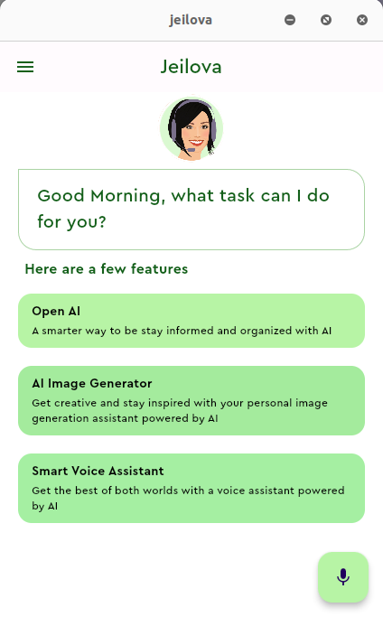

# jeilova

A cross platform virtual assistant application built on flutter with open AI

## Introduction
Deployed Page: https://adedayo924.github.io/jeilova/
Landing Page: https://adedayo924.github.io/jeilova-landing-page.github.io/

## Installation
- [Download and install the Flutter SDK](https://docs.flutter.dev/get-started/install?gclid=Cj0KCQjwqNqkBhDlARIsAFaxvwzjDUtKdNLvSfL33XNmZZB2xdvjuNqtM2AD0oWlqQYD80MXX5IomXUaAtHLEALw_wcB&gclsrc=aw.ds)
  
- Download [Android studio](https://developer.android.com/studio) or any other IDE like [VS-Code](https://code.visualstudio.com/)

- Clone jeilova github repo

```
git clone https://github.com/adedayo924/jeilova.git
```
- Open the downloaded file with an IDE
- go to the lib folder and search for secrets.dart
- Head over to open ai to generate your secret key and input it in the part commented "My Secret key goes here!" and save the file. you can use this post as hint for this process : https://www.howtogeek.com/885918/how-to-get-an-openai-api-key/ 
- go to the main.dart file and run on chrome browser or any other device connected

## Usage and Contributing 

### Video Online 
https://github.com/adedayo924/jeilova/assets/44504553/bfdbbfde-c48d-4fb0-acf9-9a804f69f39f

### Screenshot 
<h1 align="center"></h1>

### Blog
https://medium.com/@adedayo924/jeilova-an-ai-virtual-assitant-bd0345c337f5

Enjoy!!!!!
